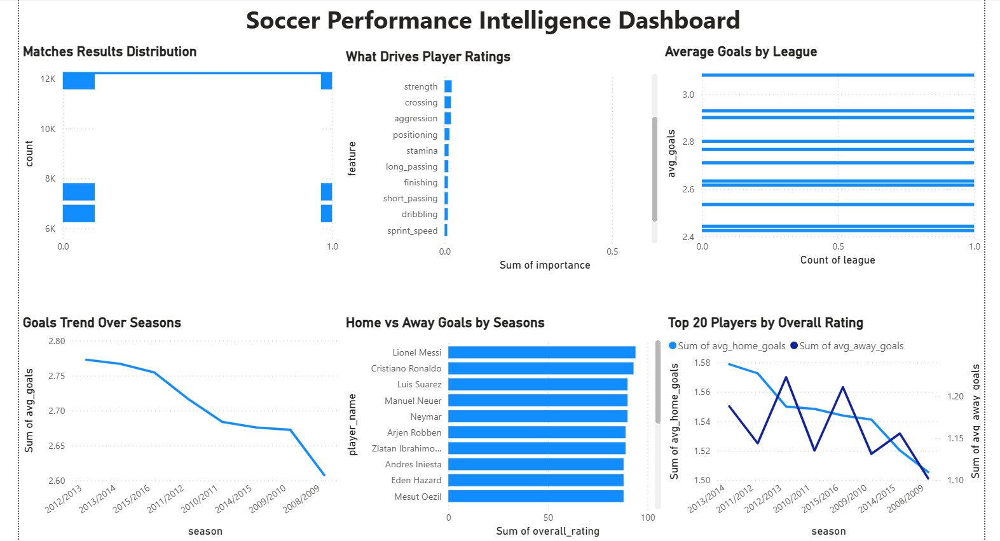

# ⚽ Soccer Performance Intelligence Dashboard

## Project Overview
A complete data analytics project analyzing 25,979 matches and 11,060 players 
across 11 European leagues from 2008 to 2016.

## Key Questions Answered
- Which players are the highest rated across their career?
- What stats actually predict match outcomes?
- Which league produces the most goals?
- Does home advantage really exist in soccer?
- What attributes drive a player's overall rating?

## Key Findings
- 🏠 Home teams win 45% of matches vs 28% for away teams
- 🇳🇱 Netherlands Eredivisie produces the most goals per match
- 🐐 Lionel Messi consistently rated highest across entire career
- ⚡ Reactions is the most important attribute for player quality
- 📈 Soccer has been getting more attacking every season
- 🇫🇷 France Ligue 1 is the most competitive league

## Tools Used
- Python (pandas, numpy, matplotlib, seaborn, scikit-learn)
- SQL (SQLite)
- Power BI (dashboard)
- Jupyter Notebooks

## Project Structure
soccer-analysis/
├── data/
│   ├── raw/          
│   └── clean/        
├── notebooks/
│   ├── 01_data_collection.ipynb
│   ├── 02_data_cleaning.ipynb
│   ├── 03_eda.ipynb
│   ├── 04_sql_analysis.ipynb
│   └── 05_machine_learning.ipynb
├── dashboard/
│   └── Soccer_Performance_Dashboard.pbix
└── README.md

## Machine Learning Models
| Model | Type | Result |
|---|---|---|
| Match outcome predictor | Classification | 44.8% accuracy |
| Player rating predictor | Regression | 0.68 MAE |

## Dashboard Preview

## What I Learned
- How to work with messy real world sports data
- How to extract insights using SQL queries
- How to build and evaluate machine learning models
- How to present findings clearly in a dashboard

## Future Improvements
- Add player transfer values to find underrated players
- Improve match predictor using team form and head to head records
- Add more recent seasons of data
- Build an expected goals (xG) model

## Data Source
[European Soccer Database](https://www.kaggle.com/datasets/hugomathien/soccer) 
by Hugo Mathien on Kaggle

## Advanced Analysis Projects

### 1. Underrated Players Finder
Identified hidden gems by comparing performance scores vs official ratings.
- 67.8% of players are overrated by FIFA ratings
- Only 0.2% qualify as highly underrated
- notebook: `06_underrated_players.ipynb`

### 2. Player Comparison Tool
Built a radar chart tool to compare any two players across 12 attributes.
- Messi beats Ronaldo 6-5 on individual attributes
- Overall ratings: Messi 94 vs Ronaldo 93
- Notebook: `07_player_comparison.ipynb`

### 3. Team Form Tracker
Tracked team performance across consecutive matches using rolling averages.
- Barcelona won 77% of all matches in the dataset
- Barcelona edges Real Madrid on points per game
- Notebook: `08_team_form_tracker.ipynb`

### 4. Expected Goals (xG) Model
Built a Gradient Boosting model to predict shot quality.
- Analyzed 636,853 shots across all matches
- Model AUC: 0.650 (30% better than random)
- Foot shots have highest xG of all shot types
- Notebook: `09_xg_model.ipynb`
